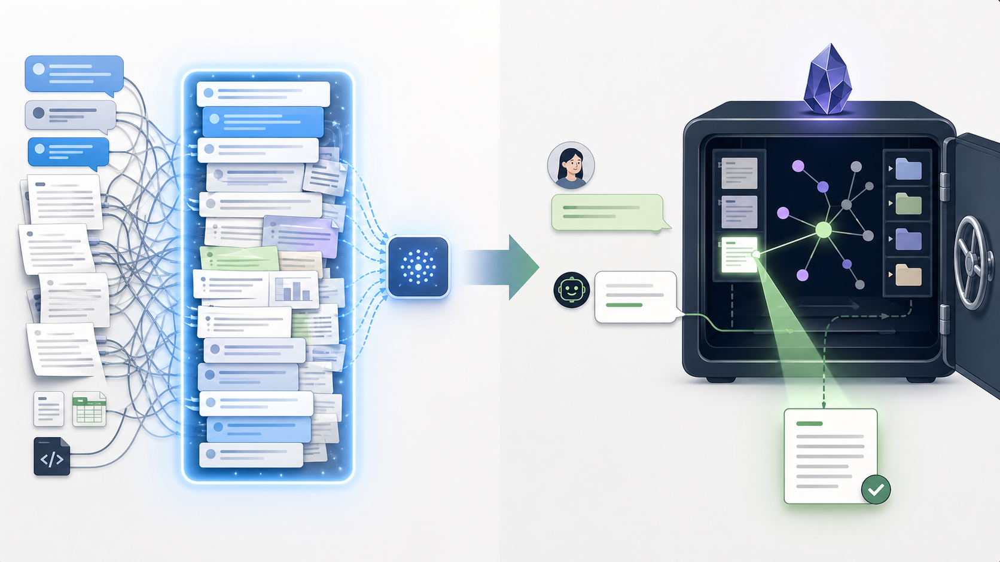

# OpenClaw Obsidian Memory

Small OpenClaw add-on for using an Obsidian vault as personal AI memory.

It gives OpenClaw two simple abilities:

- Capture: save pasted text, links, articles, GitHub repos, journal notes, ideas, and project notes into an Obsidian vault.
- Recall: search the vault before answering memory-style questions.
- Wiki maintenance: build a persistent LLM-maintained wiki from raw sources, with source pages, concept pages, project pages, `wiki/index.md`, and `wiki/log.md`.

The vault stays normal Markdown. You can open it in Obsidian, sync it, edit it manually, or back it up like any other folder.

## Recall-Based Memory Architecture

This project treats memory more like a human brain than a giant prompt.



The assistant should not load the whole vault, all old chats, or every past decision into every conversation. Normal chat should use small working memory: the current message, the current task, and only the recent context needed to reply naturally.

Long-term memory lives in Obsidian. OpenClaw should recall from it only when memory is actually needed:

- the user asks "do you remember...", "what did we decide...", "what did I save...", or "continue from last time"
- the task depends on a prior project, repo, decision, preference, person, article, saved link, or old note
- the user asks about their own saved knowledge: "what do I know about..."
- the answer would otherwise be based on a guess about past context

In this model:

- current chat = working memory
- raw notes and daily logs = experiences
- curated Markdown/wiki pages = long-term memory
- search/query = recall
- links, tags, and summaries = associations

The goal is not to make an AI that re-sends all context forever. The goal is to make an agent that can talk forward, forget irrelevant details, and deliberately retrieve the right memory when asked or when the task clearly needs it.

## Human-Like Conversation Mode

Most AI chat systems create continuity by sending the full conversation history back to the model on every turn. That works for short chats, but it is not how human memory works, and it breaks down over long-running assistants:

- the context window becomes the real memory
- old irrelevant messages keep influencing new answers
- private or stale details are replayed when they are not needed
- long sessions get slower, more expensive, and harder to reason about
- the assistant can appear to "remember" things only because the whole transcript was resent

This add-on is designed for a different pattern:

```text
Every new chat turn starts small.
The assistant answers simple tasks directly.
When recall is needed, it searches Obsidian.
Only the relevant notes/snippets are brought back into the answer.
New important events are written back to Obsidian.
```

In other words, each chat can be treated as a fresh working-memory moment. The durable brain is the Obsidian vault, not the current model context window.

The assistant should use a memory lookup when the user asks about:

- where something was saved
- what a project/repo/device/person refers to
- what happened before
- what was decided
- what was captured from a link or article
- how to continue prior work
- user-specific aliases such as a local device name, repo nickname, or standing agreement

The assistant should not do a memory lookup for universal or self-contained requests:

- "what time is it?"
- "rewrite this sentence"
- "turn this exact text into bullets"
- "run this obvious local command"
- "answer this general question that does not depend on my past context"

That is the core behavior: direct action for straight tasks, deliberate recall for context-heavy tasks.

### Example: Normal AI Chat vs Human-Like Memory Chat

Most AI assistants keep continuity by replaying the whole conversation. That makes the model sound like it remembers, but the memory is really just a long prompt.

```text
User:
Remember that "desk light" means the smart plug beside my monitor.

Normal AI:
Stores that only inside the current chat transcript.

Later, in the same long chat:
User:
Turn off the desk light.

Normal AI:
Can answer only if the earlier alias message is still inside the context window.
```

That breaks when the session gets reset, compacted, routed through another channel, or starts fresh.

This repo is built for a different behavior:

```text
User:
Remember that "desk light" means the smart plug beside my monitor.

Memory-first OpenClaw:
Saves that mapping into Obsidian.

Later, in any fresh chat:
User:
Turn off the desk light.

Memory-first OpenClaw:
Recognizes "desk light" as a personal alias.
Searches Obsidian.
Finds the saved mapping.
Uses the right local tool.
Writes the outcome back if it matters.
```

That is the human-like part. Humans do not replay every sentence from every old conversation before replying. They keep the current conversation small, recognize when something needs memory, recall the relevant fact, and continue naturally.

## OpenClaw Setup For Fresh Chats

OpenClaw has two separate pieces that are easy to confuse:

- **session transcript**: the active chat history OpenClaw can replay to the model
- **Obsidian memory**: durable Markdown memory that the assistant retrieves with tools

For a human-like memory setup, avoid making one forever-growing direct-message session the main brain.

OpenClaw direct messages commonly default to the shared main session:

```text
agent:main:main
```

That preserves conversational continuity, but it also means the active chat transcript can become the hidden memory. To make direct chats more isolated, configure DM session scoping away from `main`:

```bash
openclaw config set session.dmScope per-account-channel-peer
openclaw config set session.resetByType.direct.mode idle
openclaw config set session.resetByType.direct.idleMinutes 1
openclaw gateway restart
```

This makes direct-message routing more isolated by account, channel, and peer, then starts a fresh direct-chat session after one idle minute. It does not delete Obsidian memory. It reduces reliance on the shared `agent:main:main` transcript and pushes durable recall into the vault.

For the strongest version of this idea, add a small routing or reset layer that starts a fresh session per inbound message or per short interaction. For most personal-assistant use, a one-minute idle reset keeps short back-and-forth natural while preventing one forever session from becoming the memory system.

Pair the session behavior with this rule in `AGENTS.md`:

```text
Treat chat context as temporary working memory. Do not rely on old chat transcript history for durable recall. When a request depends on prior context, saved links, project names, decisions, locations, people, aliases, or "what was that" memory, search/query Obsidian first and answer from the retrieved notes. For simple self-contained tasks, act directly without memory lookup.
```

## Agent Prompt To Replicate This Behavior

Copy this into your agent's system instructions, `AGENTS.md`, or equivalent local behavior file:

```text
You are a memory-first personal AI assistant.

Treat the current chat as temporary working memory, not long-term memory.
Do not rely on one ever-growing chat transcript as the source of truth.
Use Obsidian as the durable memory layer.

For simple, self-contained requests, answer or act directly without memory lookup.
Examples:
- rewriting text
- answering a general question
- running an obvious local command
- formatting exact pasted content
- checking the current time or date

Before answering, search/query Obsidian when the request depends on prior context.
Use memory lookup for:
- "do you remember..."
- "what did we decide..."
- "what did I save..."
- "continue from last time"
- saved links, articles, notes, or GitHub repos
- project names, repo aliases, device aliases, people, places, decisions, or preferences
- any request where the answer would otherwise be a guess about the user's past context

When a memory lookup is needed:
1. Search/query Obsidian using the smallest useful query.
2. Read only the relevant notes/snippets.
3. Answer from the retrieved evidence.
4. Say when nothing relevant was found instead of pretending.

When something important happens, write it to Obsidian:
- decisions
- user preferences
- durable facts
- project/repo/device mappings
- links and summaries
- debugging outcomes
- reusable workflows
- unresolved follow-ups

Do not paste the entire old transcript into every new prompt.
Do not load the whole vault by default.
Do not treat compaction summaries as the main memory system.

The target behavior is human-like recall:
small current context, durable written memory, deliberate retrieval only when needed.
```

## Obsidian As The Source Of Truth

To make this work, the assistant must also write things down. Memory that is only in a model context window disappears or gets distorted.

Useful things to save:

- meaningful user asks
- important assistant outcomes
- decisions and preferences
- project/repo/device mappings
- links and crawled article text
- debugging lessons
- reusable workflows

This repo's bridge handles that by writing normal Markdown into the vault and maintaining a machine-readable log at:

```text
90-System/openclaw-memory-log.jsonl
```

A practical OpenClaw setup can also sync the direct Telegram transcript into Obsidian, for example:

```text
90-System/OpenClaw Telegram Transcript/YYYY-MM-DD.md
```

That transcript is not meant to be blindly pasted back into every prompt. It is evidence that can be searched when the user asks for recall.

## What This Does

When you tell OpenClaw:

```text
/obsidian paste anything here
```

or:

```text
save this to Obsidian: paste anything here
```

the bridge writes a Markdown note into the vault and logs the capture in `90-System/openclaw-memory-log.jsonl`.

It also accepts the common typo:

```text
/obsedian paste anything here
save this to Obsedian: paste anything here
```

## Vault Layout

Default vault:

```text
~/Documents/Obsidian-AI-Memory
```

Folders created by the bridge:

```text
00-Inbox/
01-Journal/
02-Projects/
03-Web-Clips/
04-GitHub-Repos/
05-Ideas/
06-Decisions/
90-System/
raw/
  sources/
  assets/
wiki/
  index.md
  log.md
  AGENTS.md
  sources/
  concepts/
  entities/
  projects/
  syntheses/
  questions/
  reports/
```

`raw/` is the immutable evidence layer. `wiki/` is the LLM-maintained compiled knowledge layer.

## Install

Clone or copy this repo, then:

```bash
./install.sh
```

That installs:

```text
~/.openclaw/tools/openclaw-obsidian.py
~/.openclaw/tools/openclaw-obsidian
```

Optional shell shim:

```bash
ln -sf ~/.openclaw/tools/openclaw-obsidian ~/.npm-global/bin/openclaw-obsidian
```

## Commands

Initialize the vault:

```bash
~/.openclaw/tools/openclaw-obsidian init
```

Capture memory:

```bash
~/.openclaw/tools/openclaw-obsidian capture "/obsidian remember this"
~/.openclaw/tools/openclaw-obsidian capture "save this to Obsidian: remember this"
```

If the captured text contains a URL, the bridge automatically tries to crawl and save readable page text.

Search memory:

```bash
~/.openclaw/tools/openclaw-obsidian search "what did I save about browser automation"
```

Ask a durable question and file it in the wiki:

```bash
~/.openclaw/tools/openclaw-obsidian query "what do I know about browser automation"
```

Health-check the wiki:

```bash
~/.openclaw/tools/openclaw-obsidian lint
```

Crawl and save a webpage:

```bash
~/.openclaw/tools/openclaw-obsidian crawl "https://example.com/article" "why this article matters"
```

Normal URL captures auto-crawl:

```bash
~/.openclaw/tools/openclaw-obsidian capture "save this to Obsidian: https://example.com/article revisit later"
```

Disable crawling for URL-only storage:

```bash
~/.openclaw/tools/openclaw-obsidian capture --no-crawl "save this to Obsidian: https://example.com/article revisit later"
```

Show recent captures:

```bash
~/.openclaw/tools/openclaw-obsidian recent
```

Use another vault:

```bash
OPENCLAW_OBSIDIAN_VAULT="$HOME/Documents/MyVault" ~/.openclaw/tools/openclaw-obsidian capture "/obsidian note"
```

## OpenClaw Instructions

Add the contents of [`docs/openclaw-instructions.md`](docs/openclaw-instructions.md) to your OpenClaw workspace instructions, usually:

```text
~/.openclaw/workspace/AGENTS.md
```

The user-facing workflow is plain English. The commands above are for OpenClaw/agents internally.

## Test The Setup

See [`docs/testing.md`](docs/testing.md) for end-to-end checks.

Quick shell test:

```bash
openclaw-obsidian capture "save this to Obsidian: this is a test memory from OpenClaw"
openclaw-obsidian search "test memory from OpenClaw"
```

Quick OpenClaw chat test:

```text
save this to Obsidian: my favorite test keyword is blue-river-742
```

Then ask:

```text
what did I save in Obsidian about blue-river-742?
```

OpenClaw should search the vault and answer from the saved note.

Webpage auto-crawl test:

```text
save this to Obsidian: https://example.com this page is for testing extraction
```

OpenClaw should save the URL and extracted page text, then later answer questions from that crawled content.

## OpenClaw Memory Wiki

If your OpenClaw version includes the bundled `memory-wiki` plugin, you can point it at the same vault:

```bash
openclaw plugins enable memory-wiki
openclaw config set plugins.entries.memory-wiki.config '{
  "vaultMode": "isolated",
  "vault": {
    "path": "'"$HOME"'/Documents/Obsidian-AI-Memory",
    "renderMode": "obsidian"
  },
  "obsidian": {
    "enabled": true,
    "useOfficialCli": false,
    "vaultName": "Obsidian-AI-Memory",
    "openAfterWrites": false
  },
  "ingest": {
    "autoCompile": true,
    "maxConcurrentJobs": 1,
    "allowUrlIngest": true
  },
  "search": {
    "backend": "local",
    "corpus": "wiki"
  },
  "context": {
    "includeCompiledDigestPrompt": true
  },
  "render": {
    "preserveHumanBlocks": true,
    "createBacklinks": true,
    "createDashboards": true
  }
}' --strict-json
openclaw gateway restart
openclaw wiki status
```

## What Not To Commit

Do not commit a live vault, private notes, logs, state, credentials, browser exports, or machine-specific paths. This repo should contain only the bridge, docs, and examples.

## Graphs, Vectors, And Tokens

See [`docs/memory-model.md`](docs/memory-model.md) for the practical difference between Obsidian graph links, keyword search, and vector search.
